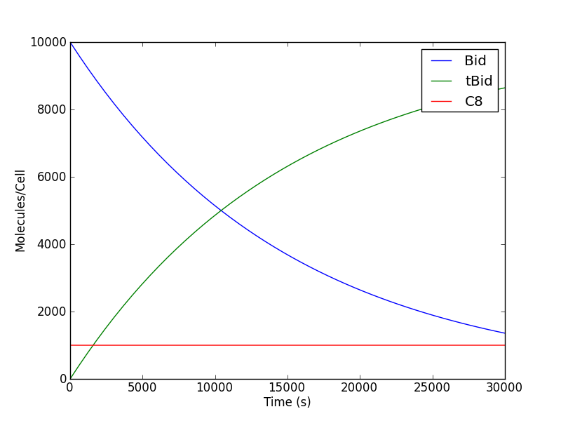

========
Tutorial
========

Introduction
============

This tutorial will walk you through the creation and simulation of a PySB model.
   
First steps
===========

Once you have installed PySB, run the following commands from a Python
interpreter to check that the basic functionality is working. This will define a
model that synthesizes a molecule "A" at the rate of 3 copies per second,
simulates that model from t=0 to 60 seconds and displays the amount of A
sampled at intervals of 10 seconds::

    >>> from pysb import *
    >>> from pysb.integrate import Solver
    >>> Model() # doctest:+ELLIPSIS
    <Model '<interactive>' (monomers: 0, rules: 0, parameters: 0, compartments: 0) at ...>
    >>> Monomer('A')
    Monomer('A')
    >>> Parameter('k', 3.0)
    Parameter('k', 3.0)
    >>> Rule('synthesize_A', None >> A(), k)
    Rule('synthesize_A', None >> A(), k)
    >>> t = [0, 10, 20, 30, 40, 50, 60]
    >>> solver = Solver(model, t)
    >>> solver.run()
    >>> print(solver.y[:, 1])
    [   0.   30.   60.   90.  120.  150.  180.]

Creating a model
================

The example above notwithstanding, PySB model definition is not meant to be
performed in an interactive environment. The proper way to create a model is to
write the code in a .py file which can then be loaded interactively or in other
scripts for analysis and simulation. Here are the Python statements necessary to
define the model from `First steps`_ above. Save this code in a file named
``tutorial_a.py`` (you can find a copy of this file and all other named scripts
from the tutorial in ``pysb/examples/``):

.. Sphinx's literalinclude interprets "/" as the doc root, i.e. the location of
   conf.py, but we can use ".." to break out!

.. literalinclude:: /../pysb/examples/tutorial_a.py

Note that we did not import ``pysb.integrate``, define the ``t`` variable or
create a ``Solver`` object. These are part of model usage, not definition, so
they do not belong here.

You may also be wondering why there are no assignment statements to be found.
This is because every PySB model component automatically assigns itself to a
variable named identically to the component's name (``A``, ``k`` and
``synthesize_A`` above), or ``model`` in the case of the ``Model`` object
itself. This is not standard Python behavior but it makes models much more
readable. The `Component`_ section below explains a bit more about this feature,
and technical readers can find even more in the `Self-export`_ section.

Using a model
=============

Now that we have created a model file, we will see how to load it and do
something with it. Here is ``run_tutorial_a.py``, the code corresponding to the
rest of the example from `First steps`_.

.. literalinclude:: /../pysb/examples/run_tutorial_a.py

The one line that's been added relative to the original listing is ``from
tutorial_a import model``. Since PySB models are just Python code, we use the
standard python ``import`` mechanism to load them. The variable ``model`` which
holds the ``Model`` object is explicitly chosen for import. All other model
components defined in ``tutorial_a.py`` are accessible through ``model``, so
there is little need to import them separately.

Model creation in depth
=======================

Every model file must begin with these two lines::

    from pysb import *
    Model()

The first line brings in all of the Python classes needed to define a model. The
second line creates an instance of the ``Model`` class and implicitly assigns
this object to the variable ``model``. We won't have to refer to ``model``
within the model file itself, rather this is the symbol we will later import
from *other* code in order to make use of the model.

The rest of the model file will be component declarations. There are several
types of components, some required and others optional. The required types are
``Monomer``, ``Parameter`` and ``Rule`` -- we have already encountered these in
``tutorial_a.py``. The optional ones are ``Observable`` and ``Compartment``.
Each of these component types is represented by a Python class which inherits
from the base class ``Component``. The following sections will explain what each
of these component types does in a model and how to create them.

Component
---------

The base ``Component`` class is never explicitly used in a model, but it defines
two pieces of basic functionality that are common to all component types. The
first is a ``name`` attribute, which is specified as the first argument to the
constructor for all subclasses of ``Component``. The second is the "self-export"
functionality, which automatically assigns every component to a local variable
named for its ``name`` attribute. Self-export helps streamline model definition,
making it feel much more like a domain-specific language like BNGL or Kappa. A
justification for the technically-minded for this somewhat unusual behavior may
be found in the `Self-export`_ section near the end of the tutorial.

Monomer
-------

Monomers are the indivisible elements that will make up the molecules and
complexes whose behavior you intend to model. Typically they will represent a
specific protein or other biomolecule such as "EGFR" or "ATP". Monomers have a
*name* (like all components) as well as a list of *sites*. Sites are named
locations on the monomer which can *bind* with a site on another monomer and/or
take on a *state*. Binding merely represents aggregation, not necessarily a
formal chemical bond. States can range from the biochemically specific (e.g.
"phosphorylated/unphosphorylated" to the generic (e.g. "active/inactive"). The
site list is technically optional (as seen in ``tutorial_a.py``) but only the
simplest toy models will be able to get by without them.

The :py:class:`Monomer constructor <pysb.core.Monomer>` takes a name, followed
by a list of site names, and finally a dict specifying the allowable states for
the sites. Sites used only for binding may be omitted from the dict.

Here we will define a monomer representing the protein **Raf**, for use in a
model of the MAPK signaling cascade. We choose to give our Raf monomer two
sites: **s** represents the serine residue on which it is phosphorylated by Ras
to activate its own kinase activity, and **k** represents the catalytic kinase
domain with which it can subsequently phosphorylate MEK. Site **s** can take on
two states: 'u' for unphosphorylated and 'p' for phosphorylated::

    Monomer('Raf', ['s', 'k'], {'s': ['u', 'p']})

Now let's provide a definition for **MEK**, the substrate of Raf. MEK has two
serine residues at positions 218 and 222 in the amino acid sequence which are
both phosphorylated by Raf. We can't call them both **s** as site names must be
unique within a monomer, so we've used the residue numbers in the sites' names
to distinguish them: **s218** and **s222**. MEK has a kinase domain of its own
for which we've again used **k**::

    Monomer('MEK', ['s218', 's222', 'k'], {'s218': ['u', 'p'], 's222': ['u', 'p']})

Adding these two monomer definitions to a new model file ``tutorial_b.py``
yields the following:

.. literalinclude:: /../pysb/examples/tutorial_b.py

We can import this model in an interactive Python session and explore its
monomers::

    >>> from tutorial_b import model
    >>> model.monomers
    ComponentSet([
     Monomer('Raf', ['s', 'k'], {'s': ['u', 'p']}),
     Monomer('MEK', ['s218', 's222', 'k'], {'s218': ['u', 'p'], 's222': ['u', 'p']}),
     ])
    >>> [m.name for m in model.monomers]
    ['Raf', 'MEK']
    >>> model.monomers[0]
    Monomer('Raf', ['s', 'k'], {'s': ['u', 'p']})
    >>> model.monomers.keys()
    ['Raf', 'MEK']
    >>> model.monomers['MEK']
    Monomer('MEK', ['s218', 's222', 'k'], {'s218': ['u', 'p'], 's222': ['u', 'p']})
    >>> model.monomers['MEK'].sites
    ['s218', 's222', 'k']

The ``Model`` class has a container for each component type, for example
``monomers`` holds the monomers. These component objects are the very same ones
you defined in your model script -- they were implicitly added to the model's
``monomers`` container by the self-export system. This container is a
``ComponentSet``, a special PySB class which acts like a list, a dict and a set
rolled into one, although it can only hold ``Component`` objects and can only be
appended to (never deleted from). Its list personality allows you to iterate
over the components or index an individual component by integer position, with
the ordering of the values corresponding to the order in which the components
were defined in the model. Its dict personality allows you to index an
individual component with its string name and use the standard ``keys`` and
``items`` methods. The set personality allows set operations with ordering
retained. For binary set operators, the left-hand operand's ordering takes
precedence.

We can also access the fields of a ``Monomer`` object such as ``name`` and
``sites``. See the :doc:`/modules/core` section of the module reference for
documentation on the fields and methods of all the component classes.

Parameter
---------

Parameters are constant numerical values that represent biological constants. A
parameter can be used as a reaction rate constant, compartment volume or initial
(boundary) condition for a molecular species. Other than *name*, the only other
attribute of a parameter is its numerical *value*.

The :py:class:`Parameter constructor <pysb.core.Parameter>` takes the name and
value as its two arguments. The value is optional and defaults to 0.

Here we will define three parameters: a forward reaction rate for the binding of
Raf and MEK and initial conditions for those two proteins::

    Parameter('kf', 1e-5)
    Parameter('Raf_0', 7e4)
    Parameter('MEK_0', 3e6)

Add these parameter definitions to our ``tutorial_b`` model file
to create ``tutorial_c.py``:

.. literalinclude:: /../pysb/examples/tutorial_c.py

Then explore the ``parameters`` container::

    >>> from tutorial_c import model
    >>> model.parameters
    ComponentSet([
     Parameter('kf', 1e-05),
     Parameter('Raf_0', 70000.0),
     Parameter('MEK_0', 3000000.0),
     ])
    >>> model.parameters['Raf_0'].value
    70000.0

Parameters as defined are unitless, so you'll need to maintain unit consistency
on your own. Best practice is to use number of molecules for species
concentrations (i.e. initial conditions) and S.I. units for everything else:
unimolecular rate constants in :math:`s^{-1}`, bimolecular rate constants in
:math:`\#molecules^{-1} \times s^{-1}`, compartment volumes in :math:`L`, etc.

In the following sections we will see how parameters are used to build other
model components.

Rules
-----

Rules define chemical reactions between molecules and complexes. A rule consists
of a *name*, a pattern describing which molecular species should act as the
*reactants*, another pattern describing how reactants should be transformed into
*products*, and parameters denoting the *rate constants*.

The :py:class:`Rule constructor <pysb.core.Rule>` takes a name, a
``RuleExpression`` containing the reactant and product patterns (more on that
below) and one or two ``Parameter`` objects for the rate constants. It also
takes several optional boolean flags as kwargs which alter the behavior of the
rule in certain ways.

.. todo - describe flags somewhere and reference it here


Rules, as described in this section, comprise the basic elements of
procedural instructions that encode biochemical interactions. In its
simplest form a rule is a chemical reaction that can be made general
to a range of monomer states or very specific to only one kind of
monomer in one kind of state. We follow the style for writing rules as
described in `BioNetGen`_ but the style proposed by `Kappa`_ is quite
similar with only some differences related to the implementation
details (e.g. mass-action vs. stochastic simulations, compartments or
no compartments, etc). We will write two rules to represent the
interaction between the reactants and the products in a two-step
manner.

The general pattern for a rule consists of the statement *Rule* and in
parenthesis a series of statements separated by commas, namely the
rule name (string), the rule interactions, and the rule
parameters. The rule interactions make use of the following
operators::

   *+* operator to represent complexation 
   *<>* operator to represent backward/forward reaction
   *>>* operator to represent forward-only reaction
   *%* operator to represent a binding interaction between two species

To illustrate the use of the operators and the rule syntax we write
the complex formation reaction with labels illustrating the parts of
the rule::

   Rule('C8_Bid_bind', C8(b=None) + Bid(b=None, S='u') <> C8(b=1) % Bid(b=1, S='u'), *[kf, kr]) 
	     |              |     |           |         |     |    |     |             |
             |              |     |           |         |     |    |     |            parameter list
	     |              |     |           |         |     |    |     |
	     |              |     |           |         |     |    |    bound species
	     |              |     |           |         |     |    |
	     |		    |     |           |         |     |   binding operator
	     |              |     |           |         |     |
	     |              |     |           |         |    bound species
	     |              |     |           |         |
	     |		    |     |           |        forward/backward operator
	     |              |     |           |
	     |		    |     |          unbound species
	     |              |     |
	     |		    |    complexation / addition operator
	     |              |
	     |		   unbound species
	    rule name

The *rule name* can be any string and should be enclosed in single (')
or double (") quotation marks. The species are *instances* of the
mononmers in a specific state. In this case we are requiring that *C8*
and *Bid* are both unbound, as we would not want any binding to occur
with species that are previously bound. The *complexation* or
*addition* operator tells the program that the two species are being
added, that is, undergoing a transition, to form a new species as
specified on the right side of the rule. The forward/backward
operator states that the reaction is reversible. Finally the *binding*
operator indicates that there is a bond formed between two or more
species. This is indicated by the matching integer (in this case *1*)
in the bonding site of both species along with the *binding*
operator. If a non-reversible rule is desired, then the *forward-only*
operator can be relplaced for the *forward/backward* operator. 

In order to actually change the state of the Bid protein we must now
edit the monomer so that have an acutal state site as follows::

   Monomer('Bid', ['b', 'S'], {'S':['u', 't']})

Having added the state site we can now further specify the state of
the Bid protein whe it undergoes rule-based interactions and
explicitly indicate the changes of the protein state.  

With this state site added, we can now go ahead and write the rules
that will account for the binding step and the unbinding step as
follows::

   Rule('C8_Bid_bind', C8(b=None) + Bid(b=None, S='u') <>C8(b=1) % Bid(b=1, S='u'), kf, kr)
   Rule('tBid_from_C8Bid', C8(b=1) % Bid(b=1, S='u') >> C8(b=None) % Bid(b=None, S='t'), kc)

As shown, the initial reactants, *C8* and *Bid* initially in the
unbound state and, for Bid, in the 'u' state, undergo a complexation
reaction and further a dissociation reaction to return the original
*C8* protein and the *Bid* protein but now in the 't' state,
indicating its truncation. Make these additions to your
:file:`mymodel.py` file. After you are done, your file should look
like this:

.. literalinclude:: examples/mymodel3.py

Once you are done editing your file, start your *ipython* (or
*python*) interpreter and type the commands at the prompts below. Once
you load your model you should be able to probe and check that you
have the correct monomers, parameters, and rules. Your output should
be very similar to the one presented (output shown below the ``'>>>'``
python prompts).::

   >>> import mymodel as m
   >>> m.model.monomers
      {'C8': Monomer(name='C8', sites=['b'], site_states={}),
      'Bid': Monomer(name='Bid', sites=['b', 'S'], site_states={'S': ['u', 't']})}
   >>> model.parameters
      {'kf': Parameter(name='kf', value=1.0e-07),
       'kr': Parameter(name='kr', value=1.0e-03),
       'kc': Parameter(name='kc', value=1.0    )}
   >>> m.model.rules
      {'C8_Bid_bind': Rule(name='C8_Bid_bind', reactants=C8(b=None) +
      Bid(b=None, S='u'), products=C8(b=1) % Bid(b=1, S='u'),
      rate_forward=Parameter(name='kf', value=1.0e-07),
      rate_reverse=Parameter(name='kr', value=1.0e-03)),
      'tBid_from_C8Bid': Rule(name='tBid_from_C8Bid', reactants=C8(b=1) %
      Bid(b=1, S='u'u), products=C8(b=None) + Bid(b=None, S=t),
      rate_forward=Parameter(name='kc', value=1.0))}

With this we are almost ready to run a simulation, all we need now is
to specify the initial conditions of the system.

Observables
-----------

In our model we have two initial species (*C8* and *Bid*) and one
output species (*tBid*). As shown in the :eq:`ODEs` derived from the
reactions above, there are four mathematical species needed to
describe the evolution of the system (i.e. *C8*, *Bid*, *tBid*, and
*C8:Bid*). Although this system is rather small, there are situations
when we will have many more species than we care to monitor or
characterize throughout the time evolution of the :eq:`ODEs`. In
addition, it will often happen that the desirable species are
combinations or sums of many other species. For this reason the
rules-based engines we currently employ implemented the *Observables*
call which automatically collects the necessary information and
returns the desired species. In our case, we will monitor the amount
of free *C8*, unbound *Bid*, and active *tBid*. To specify the
observables enter the following lines in your :file:`mymodel.py` file
as follows::

   Observable('obsC8', C8(b=None))
   Observable('obsBid', Bid(b=None, S='u'))
   Observable('obstBid', Bid(b=None, S='t'))

As shown,the observable can be a species. As we will show later the
observable can also contain wild-cards and given the "don't care don't
write" approach to rule-writing it can be a very powerful approach to
observe activated complexes.  

Initial conditions
==================
Having specified the *monomers*, the *parameters* and the *rules* we
have the basics of what is needed to generate a set of ODEs and run a
model. From a mathematical perspective a system of ODEs can only be
solved if a bound is placed on the ODEs for integration. In our case,
these bounds are the initial conditions of the system that indicate
how much non-zero initial species are present at time *t=0s* in the
system. In our system, we only have two initial species, namely *C8*
and *Bid* so we need to specify their initial concentrations. To do
this we enter the following lines of code into the :file:`mymodel.py`
file::

   Parameter('C8_0', 1000)
   Parameter('Bid_0', 10000)
   Initial(C8(b=None), C8_0)
   Initial(Bid(b=None, S='u'), Bid_0)

A parameter object must be declared to specify the initial condition
rather than just giving a value as shown above. Once the parameter
object is declared (i.e. *C8_0* and *Bid_0*) it can be fed to the
*Initial* definition. Now that we have specified the initial
conditions we are basically ready to run simulations. We will add an
*observables* call in the next section prior to running the
simulation.

Simulation and analysis
=======================
By now your :file:`mymodel.py` file should look something like this:

.. literalinclude:: examples/mymodel4.py

You can use a few commands to check that your model is defined
properly. Start your *ipython* (or *python*) interpreter and enter the
commands as shown below. Notice the output should be similar to the
one shown (output shown below the ``'>>>'``` prompts)::

   >>> import mymodel as m
   >>> m.model.monomers
      {'C8': Monomer(name='C8', sites=['b'], site_states={}),
       'Bid': Monomer(name='Bid', sites=['b', 'S'], site_states={'S': ['u', 't']})}
   >>> m.model.parameters
      {'kf': Parameter(name='kf', value=1.0e-07),
       'kr': Parameter(name='kr', value=1.0e-03),
       'kc': Parameter(name='kc', value=1.0    ),
       'C8_0': Parameter(name='C8_0', value=1000),
       'Bid_0': Parameter(name='Bid_0', value=10000)}
   >>> m.model.observables
      {'obsC8': <pysb.core.Observable object at 0x104b2c4d0>,
       'obsBid': <pysb.core.Observable object at 0x104b2c5d0>,
       'obstBid': <pysb.core.Observable object at 0x104b2c6d0>}
   >>> m.model.initial_conditions
      [(C8(b=None), Parameter(name='C8_0', value=1000)), (Bid(b=None, S=u), Parameter(name='Bid_0', value=10000))]
   >>> m.model.rules
      {'C8_Bid_bind': Rule(name='C8_Bid_bind', reactants=C8(b=None) +
      Bid(b=None, S=None), products=C8(b=1) % Bid(b=1, S=None),
      rate_forward=Parameter(name='kf', value=1.0e-07),    rate_reverse=Parameter(name='kr', value=1.0e-03)),
       'tBid_from_C8Bid': Rule(name='tBid_from_C8Bid', reactants=C8(b=1)
       % Bid(b=1, S=u), products=C8(b=None) + Bid(b=None, S=t),    rate_forward=Parameter(name='kc', value=1.0))}

With this we are now ready to run a simulation! The parameter values
for the simulation were taken directly from typical values in the
paper about `extrinsic apoptosis signaling`_. To run the simulation we
must use a numerical integrator. Common examples include LSODA, VODE,
CVODE, Matlab's ode15s, etc. We will use two *python* modules that are
very useful for numerical manipulation. We have adapted the
integrators in the *SciPy*[#sp]_ module to function seamlessly with
PySB for integration of ODE systems. We will also be using the *PyLab*
[#pl]_ package for graphing and plotting from the command line. 

We will begin our simulation by loading the model from the *ipython*
(or *python*) interpreter as shown below::

   >>> import mymodel as m

You can check that your model imported correctly by typing a few
commands related to your model as shown::

   >>> m.mymodel.monomers
   >>> m.mymodel.rules

Both commands should return information about your model. (Hint: If
you are using iPython, you can press tab twice after "m.mymodel" to
tab complete and see all the possible options). 


Now, we will import the *PyLab* and PySB simulator module. Enter
the commands as shown below::

   >>> from pysb.simulator.scipy import ScipyOdeSolver
   >>> import pylab as pl

We have now loaded the integration engine and the graph engine into
the interpreter environment. You may get some feedback from the
program as some functions can be compiled at runtime for speed,
depending on your operating system.Next we need to tell the integrator
the time domain over which we wish to integrate the equations. For our
case we will use :math:`20000s` of simulation time. To do this we
generate an array using the *linspace* function from *PyLab*. Enter
the command below::

   >>> t = pl.linspace(0, 20000)

This command assigns an array in the range :math:`[0..20000]` to the
variable *t*. You can type the name of the variable at any time to see
the content of the variable. Typing the variable *t* results in the
following::

   >>> t
   array([     0.        ,    408.16326531,    816.32653061,   1224.48979592,
            1632.65306122,   2040.81632653,   2448.97959184,   2857.14285714,
            3265.30612245,   3673.46938776,   4081.63265306,   4489.79591837,
            4897.95918367,   5306.12244898,   5714.28571429,   6122.44897959,
            6530.6122449 ,   6938.7755102 ,   7346.93877551,   7755.10204082,
            8163.26530612,   8571.42857143,   8979.59183673,   9387.75510204,
            9795.91836735,  10204.08163265,  10612.24489796,  11020.40816327,
           11428.57142857,  11836.73469388,  12244.89795918,  12653.06122449,
           13061.2244898 ,  13469.3877551 ,  13877.55102041,  14285.71428571,
           14693.87755102,  15102.04081633,  15510.20408163,  15918.36734694,
           16326.53061224,  16734.69387755,  17142.85714286,  17551.02040816,
           17959.18367347,  18367.34693878,  18775.51020408,  19183.67346939,
           19591.83673469,  20000.        ])

These are the points at which we will get data for each ODE from the
integrator. With this, we can now run our simulation. Enter the
following commands to run the simulation and get the results::

   >>> simres = ScipyOdeSolver(m.model, tspan=t).run()
   >>> yout = simres.all

To verify that the simulation run you can see the content of the
*yout* object. For example, check for the content of the *Bid*
observable defined previously::

   >>> yout['obsBid']
   array([ 10000.        ,   9601.77865674,   9224.08135988,   8868.37855506,
            8534.45591732,   8221.19944491,   7927.08884234,   7650.48970981,
            7389.81105408,   7143.5816199 ,   6910.47836131,   6689.32927828,
            6479.10347845,   6278.89607041,   6087.91189021,   5905.45001654,
            5730.89003662,   5563.68044913,   5403.32856328,   5249.39176146,
            5101.47069899,   4959.20384615,   4822.26262101,   4690.34720441,
            4563.18294803,   4440.51745347,   4322.11815173,   4207.77021789,
            4097.27471952,   3990.44698008,   3887.11517373,   3787.11923497,
            3690.30945136,   3596.54594391,   3505.69733323,   3417.64025401,
            3332.25897699,   3249.44415872,   3169.09326717,   3091.10923365,
            3015.40034777,   2941.87977234,   2870.4652525 ,   2801.07879018,
            2733.64632469,   2668.09744369,   2604.36497901,   2542.38554596,
            2482.09776367,   2423.44473279])

As you may recall we named some observables in the `Observables`_
section above. The variable *yout* contains an array of all the ODE
outputs from the integrators along with the named observables
(i.e. *obsBid*, *obstBid*, and *obsC8*) which can be called by their
names. We can therefore plot this data to visualize our output. Using
the commands imported from the *PyLab* module we can create a graph
interactively. Enter the commands as shown below::

   >>> pl.ion()
   >>> pl.figure()
   >>> pl.plot(t, yout['obsBid'], label="Bid")
   >>> pl.plot(t, yout['obstBid'], label="tBid")
   >>> pl.plot(t, yout['obsC8'], label="C8")
   >>> pl.legend()
   >>> pl.xlabel("Time (s)")
   >>> pl.ylabel("Molecules/cell")
   >>> pl.show()

You should now have a figure in your screen showing the number of
*Bid* molecules decreaing from the initial amount decreasing over
time, the number of *tBid* molecules increasing over time, and the
number of free *C8* molecules decrease to about half. For help with
the above commands and to see more commands related to *PyLab* check
the documentation [#pl]_. Your figure should look something like the
one below:



Congratulations! You have created your first model and run a
simulation!

Visualization
=============

It is useful to visualize the species and reactions that make a
model. We have provided two methods to visualize species and
reactions. We recommend using the tools in `Kappa`_ and `BioNetGen`_
for other visualization tools such as contact maps and stories.

The simplest way to visualize a model is to generate the graph file
using the programs available from the command line. The files are
located in the :file:`.../pysb/tools` directory. The files to
visualize reactions and species are :file:`render_reactions.py` and
:file:`render_species.py`. These python scripts will generate ``.dot``
graph files that can be visualized using several tool such as
`OmniGraffle`_ in :file:`OS X` or `GraphViz`_ in all major
platforms. For this tutorial we will use the `GraphViz`_ renderer. For
this example will visualize the :file:`mymodel.py` file that was
created earlier. Issue the following command, replacing the comments
inside square brackets``[]`` with the correct paths. We will first
generate the ``.dot`` from the command line as follows::

   [path-to-pysb]/pysb/tools/render_reactions.py [path-to-pysb-model-file]/mymodel.py > mymodel.dot
   
If your model can be properly visualized you should have gotten no
errors and should now have a file called :file:`mymodel.dot`. You can
now use this file as an input for any visualization tool as described
above. You can follow the same procedures with the
:file:`render_species.py` script to visualize the species generated by
your models.

Higher-order rules
================== 

For this section we will show the power working in a programming
environment by creating a simple function called "catalyze". Catalysis
happens quite often in models and it is one of the basic functions we
have found useful in our model development. Rather than typing many
lines such as::

   Rule("association",  Enz(b=None) + Sub(b=None, S="i") <> Enz(b=1)%Sub(b=1,S="i"), kf, kr)
   Rule("dissociation", Enz(b=1)%Sub(b=1,S="i") >> Enz(b=None) + Sub(b=None, S="a"), kc)
   
multiple times, we find it more powerful, transparent and easy to
instantiate/edit a simple, one-line function call such as::

   catalyze(Enz, Sub, "S", "i", "a", kf, kr, kc)

We find that the functional form captures what we mean to write: a
chemical species (the substrate) undergoes catalytic activation (by
the enzyme) with a given set of parameters. We will now describe how a
function can be written in PySB to automate the scripting of simple
concepts into a programmatic format. Examine the function below::

   def catalyze(enz, sub, site, state1, state2, kf, kr, kc):   # (0) function call
       """2-step catalytic process"""                          # (1) reaction name
       r1_name = '%s_assoc_%s' % (enz.name, sub.name)          # (2) name of association reaction for rule
       r2_name = '%s_diss_%s' % (enz.name, sub.name)           # (3) name of dissociation reaction for rule
       E = enz(b=None)                                         # (4) define enzyme state in function
       S = sub({'b': None, site: state1})                      # (5) define substrate state in function
       ES = enz(b=1) % sub({'b': 1, site: state1})             # (6) define state of enzyme:substrate complex
       P = sub({'b': None, site: state2})                      # (7) define state of product
       Rule(r1_name, E + S <> ES, kf, kr)                      # (8) rule for enzyme + substrate association (bidirectional)
       Rule(r2_name, ES >> E + P, kc)                          # (9) rule for enzyme:substrate dissociation  (unidirectional)

As shown it takes about ten lines to write the catalyze function
(shorter variants are certainly possible with more advanced *Python*
statements). The skeleton of every function in *Python* 

As shown, *Monomers*, *Parameters*, *Species*, and pretty much
anything related to rules-based modeling are instantiated as objects
in *Python*. One could write functions to interact with these objects
and they could be instantiated and inherit methods from a class. The
limits to programming biology with PySB are those enforced by the
*Python* language itself. We can now go ahead and embed this into a
model. Go back to your ``mymodel.py`` file and modify it to look
something like this:

.. literalinclude:: examples/mymodel5.py

With this you should be able to execute your code and generate figures
as described in the previous sections. 

Using provided macros
=====================

For further reference we invite the users to explore the
:file:`macros.py` file in the :file:`.../pysb/` directory. Based on
our experience with modeling signal transduction pathways we have
identified a set of commonly-used constructs that can serve as
building blocks for more complex models. In addition to some
meta-macros useful for instantiating user macros, we provide a set of
macros such as ``equilibrate``. ``bind``, ``catalyze``,
``catalyze_one_step``, ``catalyze_one_step_reversible``,
``synthesize``, ``degrade``, ``assemble_pore_sequential``, and
``pore_transport``. In addition to these basic macros we also provide
the higher-level macros ``bind_table`` and ``catalyze_table`` which we
have found useful in instantiating the interactions between families
of models. 

In what follows we expand our previous model example of ``Caspase-8``
by adding a few more species. The initiator caspase, as was described
earlier, catalytically cleaves ``Bid`` to create truncated ``Bid``
(``tBid``) in this model. This ``tBid`` then catalytically activates
Bax and Bak which eventually go on to form pores at the mitochondria
leading to mitochondrial outer-membrane permeabilization (MOMP) and eventual
cell death. To introduce the concept of higher-level macros we will
show how the ``bind_table`` macro can be used to show how a family of
inhibitors, namely ``Bcl-2``, ``Bcl-xL``, and ``Mcl-1`` inhibits a
family of proteins, namely ``Bid``, ``Bax``, and ``Bak``. 

In your favorite editor, go ahead and create a file (I will refer to
it as ::file::`mymodel_fxns`). Many rules that dictate the
interactions among species depend on a single binding site. We will
begin by creating our model and declaring a generic binding site. We
will also declare some functions, using the ``PySB`` macros and tailor
them to our needs by specifying the binding site to be passed to the
function. The first thing we do is import PySB and then import PySB
macros. Then we declare our generic site and redefine the ``pysb.macros``
for our model as follows::

   # import the pysb module and all its methods and functions
   from pysb import *
   from pysb.macros import *
   
   # some functions to make life easy
   site_name = 'b'
   def catalyze_b(enz, sub, product, klist):
       """Alias for pysb.macros.catalyze with default binding site 'b'.
       """
       return catalyze(enz, site_name, sub, site_name, product, klist)
   def bind_table_b(table):
       """Alias for pysb.macros.bind_table with default binding sites 'bf'.
       """
       return bind_table(table, site_name, site_name)

The first two lines just import the necessary modules from PySB. The
``catalyze_b``` function, tailored for the model, takes four inputs
but feeds six inputs to the ``pysb.macros.catalyze`` function, hence
making the model more clean. Similarly the ``bind_table_b`` function
takes only one entry, a list of lists, and feeds the entries needed to
the ``pysb.macros.bind_table`` macro. Note that these entries could be
contained in a header file to be hidden from the user at model time. 

With this technical work out of the way we can now actually start our
mdoel building. We will declare two sets of rates, the ``bid_rates``
that we will use for all the ``Bid`` interactions and the
``bcl2_rates`` which we will use for all the Bcl-2
interactions. Thesevalues could be specified individually as desired
as desired but it is common practice in models to use generic values
for the reaction rate parameters of a model and determine these in
detail through some sort of model calibration. We will use these
values for now for illustrative purposes. 

The next entries for the rates, the model declaration, and the
Monomers follow::

   # Bid activation rates
   bid_rates = [        1e-7, 1e-3, 1] #
   
   # Bcl2 Inhibition Rates
   bcl2_rates = [1.428571e-05, 1e-3] # 1.0e-6/v_mito
   
   # instantiate a model
   Model()
   
   # declare monomers
   Monomer('C8',    ['b'])
   Monomer('Bid',   ['b', 'S'], {'S':['u', 't', 'm']})
   Monomer('Bax',   ['b', 'S'], {'S':['i', 'a', 'm']})
   Monomer('Bak',   ['b', 'S'], {'S':['i', 'a']})
   Monomer('BclxL', ['b', 'S'], {'S':['c', 'm']})
   Monomer('Bcl2', ['b'])
   Monomer('Mcl1', ['b'])

As shown, the generic rates are declared followed by the declaration
of the monomers. We have the ``C8`` and ``Bid`` monomers as we did in
the initial part of the tutorial, the MOMP effectors ``Bid``, ``Bax``,
``Bak``, and the MOMP inhibitors ``Bcl-xL``, ``Bcl-2``, and
``Mcl-1``. The ``Bid``, ``Bax``, and ``BclxL`` monomers, in addition
to the active and inactive terms also have a ``'m'`` term indicating
that they can be in a membrane, which in this case we indicate as a
state. We will have a translocation to the membrane as part of the
reactions. 

We can now begin to write some checmical procedures. The
first procedure is the catalytic activation of ``Bid`` by ``C8``. This
is followed by the catalytic activation of Bax and Bak. ::

   # Activate Bid
   catalyze_b(C8, Bid(S='u'), Bid(S='t'), [KF, KR, KC])

   # Activate Bax/Bak
   catalyze_b(Bid(S='m'), Bax(S='i'), Bax(S='m'), bid_rates)
   catalyze_b(Bid(S='m'), Bak(S='i'), Bak(S='a'), bid_rates)

As shown, we simply state the soecies that acts as an *enzyme* as the
first function argument, the species that acts as the *reactant* with
the enzyme as the second argument (along with any state
specifications) and finally the *product* species. The ``bid_rates``
argument is the list of rates that we declared earlier. 

You may have noticed a problem with the previous statements. The
``Bid`` species undergoes a transformation from state ``S='u'`` to
``S='t'`` but the activation of ``Bax`` and ``Bak`` happens only when
``Bid`` is in state ``S='m'`` to imply that these events only happen
at the membrane. In order to transport ``Bid`` from the ``'t'`` state
to the ``'m'`` state we need a transporf function. We achieve this by
using the *equilibrate* macro in PySB between these states. In
addition we use this same macro for the transport of the ``Bax``
species and the ``BclxL`` species as shown below. ::

   # Bid, Bax, BclxL "transport" to the membrane
   equilibrate(Bid(b=None, S='t'),   Bid(b=None, S='m'), [1e-1, 1e-3])
   equilibrate(Bax(b=None, S='m'),   Bax(b=None, S='a'), [1e-1, 1e-3])
   equilibrate(BclxL(b=None, S='c'), BclxL(b=None, S='m'), [1e-1, 1e-3])

According to published experimental data, the Bcl-2 family of
inhibitors can inhibit the initiator ``Bid`` and the effector ``Bax``
and ``Bak``. These family has complex interactions with all these
proteins. Given that we have three inhibitors, and three molecules to
be inhibited, this indicates nine interactions that need to be
specified. This would involve writing nine reversible reactions in a
rules language or at least eighteen reactions for each direction if we
were writing the ODEs. Given that we are simply stating that these
species *bind* to inhibit interactions, we can take advantage of two
things. In the first case we have already seen that there is a *bind*
macro specified in PySB. We can further functionalize this into a
higher level macro, naemly the *bind_table* macro, which takes a table
of interactions as an argument and generates the rules based on these
simple interactions. We specify the bind table for the inhibitors (top
row) and the inhibited molecules (left column) as follows. ::

   bind_table_b([[                  Bcl2,  BclxL(S='m'),       Mcl1],
                 [Bid(S='m'), bcl2_rates,  bcl2_rates,   bcl2_rates],
                 [Bax(S='a'), bcl2_rates,  bcl2_rates,         None],
                 [Bak(S='a'),       None,  bcl2_rates,   bcl2_rates]])

As shown the inhibitors interact by giving the rates of interactions
or the *"None"* Python keyword to indicate no interaction. The only
thing left to run this simple model is to declare some initial
conditions and some observables. We declare the following::

   # initial conditions
   Parameter('C8_0',    1e4)
   Parameter('Bid_0',   1e4)
   Parameter('Bax_0',  .8e5)
   Parameter('Bak_0',  .2e5)
   Parameter('BclxL_0', 1e3)
   Parameter('Bcl2_0',  1e3)
   Parameter('Mcl1_0',  1e3)
   
   Initial(C8(b=None), C8_0)
   Initial(Bid(b=None, S='u'), Bid_0)
   Initial(Bax(b=None, S='i'), Bax_0)
   Initial(Bak(b=None, S='i'), Bak_0)
   Initial(BclxL(b=None, S='c'), BclxL_0)
   Initial(Bcl2(b=None), Bcl2_0)
   Initial(Mcl1(b=None), Mcl1_0)
   
   # Observables
   Observable('obstBid', Bid(b=None, S='m'))
   Observable('obsBax', Bax(b=None, S='a'))
   Observable('obsBak', Bax(b=None, S='a'))
   Observable('obsBaxBclxL', Bax(b=1, S='a')%BclxL(b=1, S='m'))

By now you should have a file with all the components that looks
something like this:

.. literalinclude:: examples/mymodel_fxns.py

With this you should be able to run the simulations and generate
figures as described in the basic tutorial sections. 


Compartments
============
We will continue building on your :file:`mymodel_fxns.py` file and add one
more species and a compartment. In extrinsic apoptosis, once *tBid* is
activated it translocates to the outer mitochondrial membrane where it
interacts with the protein *Bak* (residing in the membrane). 


Model calibration
=================

Modules
=======

Miscellaneous
=============

Self-export
-----------

For anyone who feels a little queasy about self-export, this section will try to
explain the rationale behind it.

In order to make model definition feel like a domain-specific language specially
designed for model construction, the mechanism for component definition needs to
provide three things:

* It must provide an internal name so that components can be usefully
  distinguished when inspected interactively, or translated into various output
  file formats such as BNGL.
* The component object must be assigned to a local variable so that subsequent
  component declarations can reference it by name using normal Python syntax
  (including operator overloading).
* The object must also be inserted into the data structures of the model object
  itself.

Without self-export, every component definition would need to manage these
points explicitly::

    A = Monomer('A')
    model.add_component(A)
    B = Monomer('B')
    model.add_component(B)

This pattern introduces several opportunities for error, for example a ``name``
argument and the corresponding variable name may end up out of sync or the
modeler may forget an ``add_component`` call. The redundancy also introduces
visual noise which makes the code harder to read. Furthermore, self-export makes
model modularization much simpler, as components may be defined within functions
without forcing the function to explicitly return them or requiring extra code
in the caller to deal with the returned components.

In addition to ``Component`` and its subclasses, the ``Model`` constructor also
utilizes self-export, with two differences: The local variable is always named
``model``, and the ``name`` argument is optional and defaults to the full
hierarchical name of the module from which ``Model()`` is called, e.g.
``pysb.examples.tutorial_a``.


.. rubric:: Footnotes

.. [#sp] SciPy: http://www.scipy.org

.. [#pl] PyLab: http://www.scipy.org/PyLab

.. _BioNetGen: http://bionetgen.org/index.php/Documentation

.. _Kappa: http://www.kappalanguage.org/documentation

.. _extrinsic apoptosis signaling: http://www.plosbiology.org/article/info%3Adoi%2F10.1371%2Fjournal.pbio.0060299

.. _Sorger lab: http://sorger.med.harvard.edu/

.. _GraphViz: http://www.graphviz.org/

.. _OmniGraffle: http://www.omnigroup.com/products/omnigraffle/
